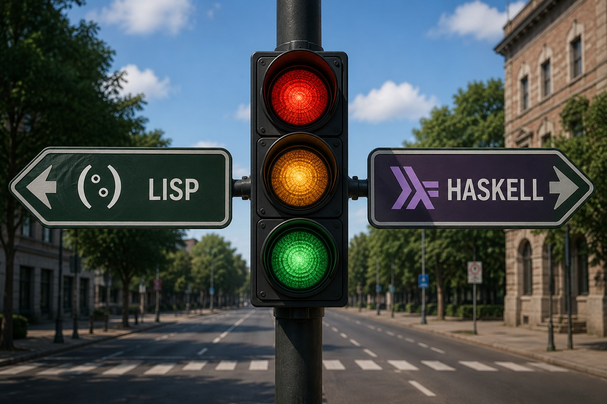

  

<h1 align="center">🚦 TPI Funcional 2026 - Grupo 43</h1>

  <strong>Simulación de Semáforos en Paradigma Funcional (Lisp).</strong>

  
  
  

---

## 👥 Integrantes
* **Veloso Franco** - [franco05555](https://github.com/franco05555)
* **Otero Emmanuel** - [emmactes](https://github.com/emmactes)
* **Gonzalez Federico** - [fede7218](https://github.com/fede1728)

## 🎓 Plantel Docente
* **Responsable:** Msc. Ricardo Monzón
* **JTP:** Ringa, Mónica - Rodríguez, Leandro
* **Ayudantes de 1°:** Mascazzini Matías - Ramírez, Walter
